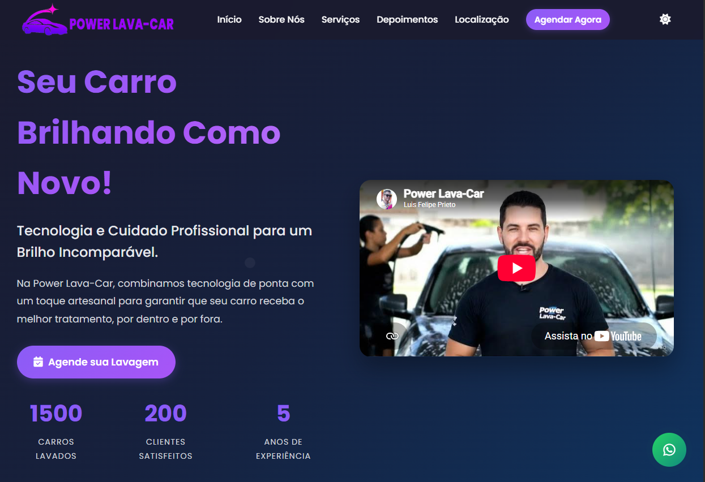

<div align="center">

# 🚗 Power Lava-Car

### Site institucional responsivo para serviços de estética automotiva

<br>


<br><br>

<a href="https://lipeprieto.github.io/PowerLavaCar/">
  
</a>

<a href="https://github.com/LipePrieto/PowerLavaCar">
  
</a>

<br><br>



</div>

---

## 📖 Sobre o projeto

O **Power Lava-Car** é um projeto de site institucional desenvolvido para apresentar serviços de lavagem e estética automotiva de maneira moderna, clara e profissional.

A página permite que o visitante conheça os serviços disponíveis, visualize os preços, monte um pacote personalizado, consulte a localização e envie uma solicitação de agendamento diretamente pelo WhatsApp.

O projeto foi construído utilizando apenas tecnologias front-end, sem necessidade de servidor ou banco de dados.

---

## 🌐 Projeto publicado

O site está disponível gratuitamente pelo GitHub Pages:

### [🚗 Acessar Power Lava-Car](https://lipeprieto.github.io/PowerLavaCar/)

---

## 🎯 Objetivo

O objetivo deste projeto foi desenvolver uma solução digital capaz de ajudar um estabelecimento de estética automotiva a:

- Apresentar seus serviços
- Divulgar preços
- Receber solicitações de agendamento
- Facilitar o contato pelo WhatsApp
- Apresentar sua localização
- Demonstrar credibilidade
- Melhorar sua presença digital
- Oferecer uma experiência moderna em celulares e computadores

---

## ✨ Funcionalidades

- Página inicial moderna e responsiva
- Menu de navegação para computadores e celulares
- Alternância entre tema claro e escuro
- Preferência de tema salva no navegador
- Apresentação dos serviços e preços
- Calculadora de pacote personalizado
- Atualização automática do valor selecionado
- Agendamento diretamente pelo WhatsApp
- Formulário com validação de campos
- Formatação automática do número de telefone
- Bloqueio de datas anteriores
- Bloqueio de agendamento aos domingos
- Cálculo automático do valor do serviço
- Opção de serviço leva e traz
- Status automático de estabelecimento aberto ou fechado
- Contadores animados
- Vídeos integrados do YouTube
- Depoimentos de clientes
- Integração com Google Maps
- Botão para traçar rota
- Animações durante a rolagem
- Desenho animado em SVG
- Botão flutuante do WhatsApp
- Página adicional sobre a empresa
- Informações de endereço e horário de funcionamento

---

## 🛠️ Tecnologias utilizadas

| Tecnologia | Utilização |
|---|---|
| HTML5 | Estrutura e conteúdo das páginas |
| CSS3 | Estilização, layout, temas e responsividade |
| JavaScript | Interações, validações e cálculos |
| AOS | Animações durante a rolagem |
| GSAP | Animação do desenho SVG |
| Font Awesome | Ícones da interface |
| Google Fonts | Tipografia do projeto |
| YouTube Embed | Exibição dos vídeos |
| Google Maps | Localização do estabelecimento |
| WhatsApp | Recebimento das solicitações |
| Git e GitHub | Versionamento do código |
| GitHub Pages | Hospedagem gratuita do site |

---

## 🧩 Principais seções

### 🏠 Página inicial

A seção principal apresenta:

- Título e proposta do negócio
- Vídeo em destaque
- Botão para agendamento
- Número de carros lavados
- Clientes atendidos
- Anos de experiência

### 🚿 Serviços

O visitante pode consultar serviços como:

- Lavagem expressa
- Lavagem completa
- Cera cristalizadora
- Higienização interna
- Polimento de faróis
- Serviço leva e traz

### 🧮 Pacote personalizado

O usuário pode selecionar vários serviços e acompanhar o valor total sendo calculado automaticamente.

Depois da seleção, uma mensagem personalizada é criada e enviada para o WhatsApp.

### 📅 Agendamento

O formulário de agendamento solicita:

- Nome
- Telefone
- Serviço desejado
- Data
- Serviço leva e traz

O valor estimado é calculado automaticamente antes do envio.

### 📍 Localização

A página apresenta:

- Endereço
- Telefones
- E-mail
- Horários de funcionamento
- Status aberto ou fechado
- Mapa incorporado
- Botão para traçar rota

---

## 🧮 Calculadora de pacotes

O projeto possui uma calculadora que permite selecionar vários serviços:

```text
☑ Lavagem completa
☑ Cera cristalizadora
☑ Polimento de faróis
☑ Higienização interna
☑ Higienização do ar-condicionado
☑ Serviço leva e traz
```

O JavaScript soma os valores selecionados e apresenta o resultado em reais:

```text
Total: R$ 235,00
```

Ao clicar em **Agendar Pacote via WhatsApp**, o sistema monta uma mensagem contendo os serviços e o valor total.

---

## 📲 Integração com WhatsApp

O site não precisa de backend para receber solicitações.

Após a validação do formulário, o JavaScript cria uma mensagem como esta:

```text
Olá! Gostaria de agendar meu serviço:

Nome: Nome do cliente
Telefone: (14) 99999-9999
Serviço: Lavagem completa
Data: 30/07/2026
Leva e traz: Sim
Total estimado: R$ 85,00
```

Em seguida, o usuário é direcionado para o WhatsApp com a mensagem pronta para envio.

---

## ✅ Validações do formulário

Antes de liberar o agendamento, o sistema verifica:

- Se o nome foi preenchido
- Se o telefone possui 11 dígitos
- Se um serviço foi selecionado
- Se uma data foi informada
- Se a data não está no passado
- Se a data escolhida não é domingo

O telefone também recebe formatação automática:

```text
(14) 99999-9999
```

---

## 🌗 Tema claro e escuro

O usuário pode alternar entre:

```text
☀️ Tema claro
🌙 Tema escuro
```

A preferência é armazenada no navegador utilizando:

```javascript
localStorage
```

Assim, o tema selecionado continua ativo quando o usuário acessa novamente o site.

---

## 🕐 Status de funcionamento

O site verifica automaticamente o dia e o horário atual para informar se o estabelecimento está:

```text
Aberto
```

ou:

```text
Fechado
```

Horários configurados:

```text
Segunda a sexta: 08h às 18h
Sábado: 08h às 12h
Domingo: fechado
```

---

## 📱 Responsividade

O projeto foi desenvolvido para funcionar em:

- Computadores
- Notebooks
- Tablets
- Celulares

Em telas menores, o menu tradicional é substituído por um menu hambúrguer, facilitando a navegação.

---

## 🔍 SEO e compartilhamento

O projeto possui recursos básicos de otimização:

- Título personalizado
- Meta description
- Palavras-chave
- Informações para compartilhamento
- Dados estruturados com Schema.org
- Descrição de imagens
- Configuração de idioma
- Favicon

---

## ⚙️ Como executar

### 1. Clone o repositório

```bash
git clone https://github.com/LipePrieto/PowerLavaCar.git
```

### 2. Entre na pasta

```bash
cd PowerLavaCar
```

### 3. Abra o projeto

Abra o arquivo:

```text
index.html
```

Também é possível utilizar a extensão **Live Server** no Visual Studio Code.

---

## 📂 Estrutura principal

```text
PowerLavaCar/
├── index.html
├── sobre.html
├── styles.css
├── script.js
├── preview.png
├── favicon.png
├── logotipocompleto.png
├── imagens e arquivos do projeto
└── README.md
```

---

## 🔧 Como personalizar

### Alterar serviços e preços

Abra o arquivo:

```text
index.html
```

Procure pela seção de serviços e altere o conteúdo desejado.

Exemplo:

```html
<h3 class="service-title">Lavagem Completa</h3>
<p class="service-description">
  Lavagem detalhada externa e interna.
</p>
<span class="service-price">R$ 80,00</span>
```

Também atualize o preço correspondente no formulário e na calculadora de pacotes.

### Alterar o WhatsApp

Abra:

```text
script.js
```

Procure pelo número:

```javascript
5514988388121
```

Substitua pelo número desejado utilizando:

```text
55 + DDD + número
```

Exemplo:

```text
5514999999999
```

### Alterar horários

No arquivo `script.js`, procure a função responsável pelo status da loja.

No HTML, atualize também os horários exibidos na seção de localização.

---

## 🚀 Publicação

O projeto está hospedado com GitHub Pages.

Link publicado:

```text
https://lipeprieto.github.io/PowerLavaCar/
```

Quando uma alteração é enviada para a branch `main`, o GitHub Pages publica automaticamente a nova versão.

---

## 📚 Aprendizados

Durante o desenvolvimento deste projeto, pratiquei:

- Estruturação de páginas com HTML semântico
- Criação de layouts responsivos
- Manipulação do DOM
- Eventos em JavaScript
- Validação de formulários
- Formatação de dados
- Cálculo automático de valores
- Integração com WhatsApp
- Uso de localStorage
- Integração com mapas e vídeos
- Animações utilizando bibliotecas externas
- Criação e animação de SVG
- Organização de um projeto web
- Versionamento utilizando Git
- Publicação com GitHub Pages
- Desenvolvimento voltado para uma necessidade comercial

---

## 🔮 Melhorias futuras

- Painel administrativo para alterar preços
- Integração com banco de dados
- Cadastro de horários disponíveis
- Confirmação automática de agendamentos
- Sistema para evitar horários duplicados
- Área administrativa protegida
- Galeria de antes e depois
- Avaliações reais dos clientes
- Integração com Google Analytics
- Otimização adicional de desempenho
- Aplicação instalável como PWA

---

## 👨‍💻 Autor

Desenvolvido por **Luis Felipe Prieto**.

<div align="center">

<a href="https://github.com/LipePrieto">
  
</a>

<a href="https://www.linkedin.com/in/luisfelipeprieto1/">
  
</a>

</div>

---

## 📄 Licença

Este projeto está distribuído sob a licença MIT.

Consulte o arquivo [LICENSE](LICENSE) para mais informações.

---

<div align="center">

### 🚗 Power Lava-Car

**Tecnologia e cuidado profissional para um brilho incomparável.**

## © Direitos autorais

Copyright © 2026 Luis Felipe Prieto. Todos os direitos reservados.

Este projeto foi desenvolvido para fins de portfólio e demonstração.

Não é permitida a reprodução, distribuição, modificação, comercialização
ou utilização total ou parcial deste projeto sem autorização prévia do autor.

<br>

<a href="https://lipeprieto.github.io/PowerLavaCar/">
  
</a>

</div>
